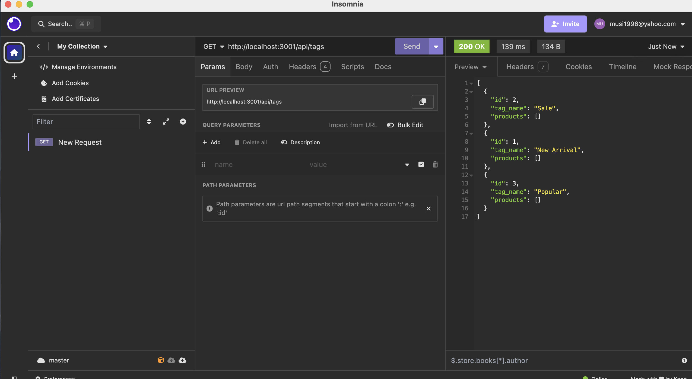
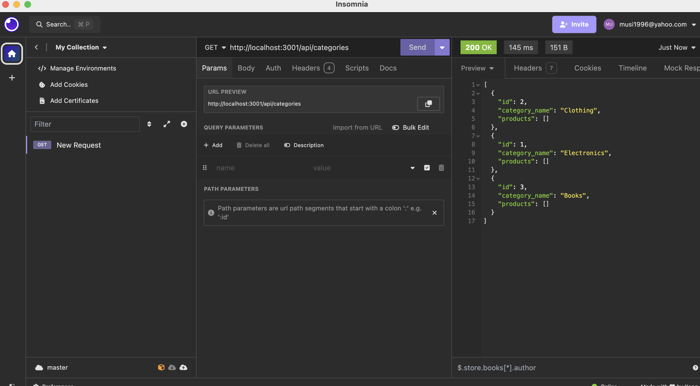

# backend-e-commerce

## User Story

As a manager at an internet retail company,
I want a back end for my e-commerce website that leverages the latest technologies,
so that my company can remain competitive in the e-commerce industry.

Given a functional Express.js API,

When I add my database name, PostgreSQL username, and PostgreSQL password to an environment variable file,
Then I am able to connect to a PostgreSQL database using Sequelize.
Given that the schema and seed commands are entered,

When I execute these commands,
Then a development database is created and populated with test data.
Given that I invoke the application,

When the server starts,
Then the Sequelize models are successfully synced to the PostgreSQL database.
Given that I open API GET routes in Insomnia Core for categories, products, or tags,

When I make requests to these endpoints,
Then the data for each route is displayed in a formatted JSON response.
Given that I test API POST, PUT, and DELETE routes in Insomnia Core,

When I perform create, update, or delete operations,
Then the corresponding data in the database is successfully modified as per the request.

## Mock-Up

## Video-Demo